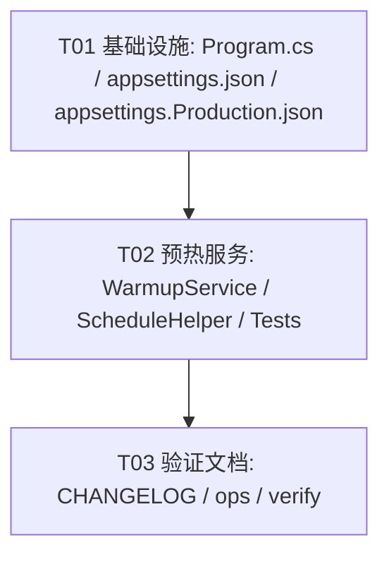

# 板块基金雷达定时预热 —— 系统设计与任务分解

> 角色：架构师（高见远） ｜ 项目：ASP.NET Core 8 基金记账（小白养基） ｜ 语言：中文
> 问题：`GET /api/fund/sectors` 每次打开慢，根因是**数据没有主动预热**，缓存仅在“用户打开且过期”时才重建。
> 目标：新增后端定时预热托管服务，让 Redis/内存里的板块数据常年保持新鲜，**打开即命中、零等待**（常热 / hot 策略）。

---

## Part A：系统设计

### 1. 实现方案与框架选型

#### 1.1 核心难点（已 Read 核对）

- 板块数据构建入口 `BuildSectorRadarPayloadAsync()`（`Controllers/FundController.cs` L8454+）需要：
  `GetAllFundsAsync()` 取全市场基金 → 按主题归类 → 并发（Semaphore=12）逐基金发外部行情 HTTP（自建 `HttpClient`，Timeout 6s）→ 再并发预取历史净值算连涨/连跌。整体耗时 **10–30s 量级**。
- `GetSectors([FromQuery] bool force=false)`（L8227-8428）是“懒加载”：
  1. 读 Redis `api:fund:sectors:v3` → 命中即返回（`X-App-Cache: redis`）；
  2. 读数据库缓存 `_marketCache.TryGetAsync("sector_radar_v4")`；
  3. 读内存 fresh `FundSectorRadarV7` → 回填 Redis 返回；
  4. 读内存 stale `FundSectorRadarV7_Stale` → 后台 `Task.Run(RefreshSectorCacheQuietlyAsync)` 并返回；
  5. 防并发 `if (!await _sectorsRefreshLock.WaitAsync(0))` → **返回 503 “板块基金雷达正在刷新，请稍后重试”**（关键风险点）；
  6-8. 取锁后复查 Redis/fresh/stale，最后 `BuildSectorRadarPayloadAsync()` → `SetSectorRadarCache(payload)` → 写 Redis + 内存 + DB 缓存；
  9. 失败兜底返回 stale / 500。
- TTL：`GetExternalDataFreshTtl()`（L107-121）周末 30min；交易日交易时段（9:25-11:35 / 12:55-15:10）**2min**，其余 30min。`_staleExternalDataTtl = 6h`（L101）。`_sectorsRefreshLock` 为 `private static readonly SemaphoreSlim _sectorsRefreshLock = new(1,1)`（L97）。
- 构造函数（L124-144）注入：`IMemoryCache _cache`、`IConnectionMultiplexer _redis`、`MarketCacheService _marketCache`、`IHttpClientFactory _httpClientFactory` 等。

> 结论：缓存只在“有人打开且已过期”时才重建；TTL 一过（交易时段仅 2min），下一位打开者要等整轮构建完成，若全冷还会 503。官方站点快是因为数据常年**预计算 + 常热**。

#### 1.2 预热调用方式选型：**推荐 A1（自 ping 本进程端点）**

| 维度 | A1 自 ping 端点（推荐） | A2 抽服务直调 |
|---|---|---|
| 控制器改动 | **0 行** | 需把 `BuildSectorRadarPayloadAsync` / `SetSectorRadarCache` 及依赖（`_cache`/`_redis`/`_marketCache`/`GetAllFundsAsync`）搬到新的 `SectorRadarCacheService` |
| 回归面 | 极小（完全复用既有逻辑） | 大（控制器多处方法搬家） |
| 503 风险 | 经 `GetSectors` 复用 `_sectorsRefreshLock`；但被 stale(6h) 兜底，正常运营几乎不触发 | 独立后台锁，零 503 |
| 写 Redis/内存/DB 缓存 | 是（100% 复用 `GetSectors` 写回路径） | 是（需手动复制写回路径） |
| 实现复杂度 | 低 | 中 |

**选 A1 的理由：**

1. **零控制器改动**，回归风险最低；完全复用线上已验证的 `GetSectors` 构建 + 写回（Redis + 内存 fresh/stale + DB 缓存），不重复实现写缓存路径，避免“预热写一份、接口又写一份”的不一致。
2. **503 风险已被既有设计消解**：`GetSectors` 只有在缓存**全冷**（Redis/DB/fresh/stale 全 miss）时才会到 `_sectorsRefreshLock` 并返回 503。只要预热按 fresh TTL（交易 2min）运行，内存 `FundSectorRadarV7_Stale`（TTL 6h）几乎永远存在——真实用户在“冷”时实际先命中 step 4 stale 并后台刷新，**根本到不了 503 分支**。503 仅在“预热连续 6h 未成功”的极端场景才可能，而“启动即预热一次 + 周期重试”令其概率趋近 0。
3. **预热周期 == fresh TTL**，保证在 Redis/内存 fresh 过期前已重建完成 → 常热。

**A2 作为后续加固**（本设计不采用）：若未来要 100% 消除 503（极端可用性要求），再把 `Build/Set` 抽到 `SectorRadarCacheService`（singleton，注入依赖），托管服务直调并用独立锁。代价是需改动控制器、回归面大。

#### 1.3 自 ping 端点与 base URL

- 预热服务通过 `HttpClient` 自 ping：`GET {SelfBaseUrl}/api/fund/sectors?force=true`
- `SelfBaseUrl` 来源（优先级）：`appsettings` 的 `SelfBaseUrl` 配置项 → 缺省 `http://127.0.0.1:7084`
  - 用 `127.0.0.1:7084` 绕开 nginx/TLS，直连本进程 Kestrel，开销最低且不受反代超时影响。
  - **`force=true` 不可省略**：否则命中 Redis/缓存直接返回、不重建，预热失去意义。
- `GetSectors` 已在 `Program.cs` 的 JWT 免鉴清单（L160 `path.StartsWith("/api/fund/sectors")`），自 ping 无需 token。

#### 1.4 周期机制（BackgroundService）

- 复用现有 `FundScraperService`（L13-47）的写法：`: BackgroundService` + `while(!stoppingToken.IsCancellationRequested)` + `Task.Delay(interval, stoppingToken)` + try/catch 包裹、`OperationCanceledException` 时 `break`。
- 启动后先做**就绪等待**：轮询 `GET {baseUrl}/api/health` 直到 200（最多 ~60s，短延迟、尊重 `stoppingToken`），避免 Kestrel 尚未监听导致首拍失败。
- 就绪后立即**预热一次**（启动即有热数据）。
- 单次预热：`self-ping force=true` → 校验 200 → 按当前是否交易时段计算下次延迟 → `Task.Delay`。
- 延迟取值 `SectorRadarScheduleHelper.GetWarmupInterval()`：**交易时段 2min，非交易/周末 30min** —— 与 `FundController.GetExternalDataFreshTtl()` 对齐。
- 优雅关闭：所有 `Task.Delay` 与 HTTP 调用均传 `stoppingToken`。

#### 1.5 失败处理（D 点）

- 单次预热整体 `try/catch`：失败仅 `Console.WriteLine($"[警告] 板块雷达预热失败: {ex.Message}")`，**不抛给 BackgroundService 导致进程崩溃**（与既有 `RefreshSectorCacheQuietlyAsync` L8440 风格一致）。
- 下次周期自动重试；不改动 `GetSectors` 任何兜底逻辑。

#### 1.6 与 `_sectorsRefreshLock` 的关系（C 点）

- A1 下，预热经 `GetSectors(force=true)` 自然复用 `_sectorsRefreshLock`（取锁→构建→释放）。
- **定调：接受复用**。原因：stale(6h) 兜底使真实用户运营期不触达 503；且锁串行化了“预热构建”与“用户 stale 触发的后台刷新”，避免重复全市场扫描。若改用 A2 才需独立锁。

---

### 2. 文件列表（新增 / 修改）

| 路径 | 操作 | 说明 |
|---|---|---|
| `Services/SectorRadarWarmupService.cs` | **新增** | 预热托管服务 `: BackgroundService`，自 ping 实现 |
| `Services/SectorRadarScheduleHelper.cs` | **新增** | 静态工具：`ChinaNow()` / `IsTradingTimeNow()` / `GetWarmupInterval()`（与控制器 TTL 对齐，便于复用与单测） |
| `Services/SectorRadarWarmupServiceTests.cs` | **新增** | 针对 schedule helper 与构造注入的单元测试（不依赖真实 HTTP） |
| `Program.cs` | **修改** | ①新增命名 `HttpClient` `SectorWarmup`（Timeout 180s）；②`AddHostedService<SectorRadarWarmupService>()` |
| `appsettings.json` | **修改** | 增加 `"SelfBaseUrl": "http://127.0.0.1:7084"`（缺省值，可被环境配置覆盖） |
| `appsettings.Production.json` | **修改（可选）** | 若生产监听地址与缺省不同，显式覆盖 `SelfBaseUrl` |
| `CHANGELOG.md` | **修改** | 由主理人追加版本说明（见任务 T03） |

> A2 才需 `Services/SectorRadarCacheService.cs` + 改 `Controllers/FundController.cs`，本设计不采用。

---

### 3. 数据结构与接口（类图）

完整图见 `docs/class-diagram.mermaid`。要点：

- **`SectorRadarWarmupService : BackgroundService`**
  - 构造注入：`IHttpClientFactory`、`IConfiguration`、`ILogger<SectorRadarWarmupService>`
  - 字段：`HttpClient _httpClient`、`string _selfBaseUrl`
  - 方法：
    - `protected override Task ExecuteAsync(CancellationToken stoppingToken)`
    - `private async Task WarmupOnceAsync(CancellationToken stoppingToken)` —— 自 ping `force=true` 并校验 200
    - `private async Task WaitForServerReadyAsync(CancellationToken stoppingToken)` —— 轮询 `/api/health`
    - `private static TimeSpan GetWarmupInterval()` —— 2min / 30min
    - `private static bool IsTradingTimeNow()`
    - `private static DateTime ChinaNow()`
- **`SectorRadarScheduleHelper`**（static）：聚合时间判断，供预热服务与（未来）控制器共用，避免 TTL 逻辑漂移。
- 关系：`SectorRadarWarmupService --> IHttpClientFactory` / `--> IConfiguration` / `--> ILogger`（注入）；`SectorRadarWarmupService ..> SectorRadarScheduleHelper`（静态调用）；`SectorRadarWarmupService ..> FundController`（HTTP 自 ping `GET /api/fund/sectors?force=true`）。

关键签名（伪代码）：

```csharp
public class SectorRadarWarmupService : BackgroundService
{
    private const string DefaultSelfBaseUrl = "http://127.0.0.1:7084";
    private readonly HttpClient _httpClient;
    private readonly string _selfBaseUrl;
    private readonly ILogger<SectorRadarWarmupService> _logger;

    public SectorRadarWarmupService(
        IHttpClientFactory httpClientFactory,
        IConfiguration configuration,
        ILogger<SectorRadarWarmupService> logger)
    {
        _httpClient = httpClientFactory.CreateClient("SectorWarmup");
        _selfBaseUrl = configuration["SelfBaseUrl"] ?? DefaultSelfBaseUrl;
        _logger = logger;
    }

    protected override async Task ExecuteAsync(CancellationToken stoppingToken)
    {
        await WaitForServerReadyAsync(stoppingToken);          // 就绪等待
        while (!stoppingToken.IsCancellationRequested)
        {
            try
            {
                await WarmupOnceAsync(stoppingToken);          // 自 ping force=true
                await Task.Delay(GetWarmupInterval(), stoppingToken);
            }
            catch (OperationCanceledException) when (stoppingToken.IsCancellationRequested)
            {
                break;
            }
            catch (Exception ex)
            {
                Console.WriteLine($"[警告] 板块雷达预热失败: {ex.Message}"); // 不崩溃，下周期重试
                try { await Task.Delay(TimeSpan.FromSeconds(30), stoppingToken); }
                catch (OperationCanceledException) { break; }
            }
        }
    }
}

// 周期常量（与 FundController.GetExternalDataFreshTtl 对齐）
public static class SectorRadarScheduleHelper
{
    public static TimeSpan TradingInterval => TimeSpan.FromMinutes(2);
    public static TimeSpan OffTradingInterval => TimeSpan.FromMinutes(30);
    public static DateTime ChinaNow() => DateTime.UtcNow.AddHours(8);
    public static bool IsTradingTimeNow() { /* 9:25-11:35 / 12:55-15:10，周末 false */ }
    public static TimeSpan GetWarmupInterval()
        => IsTradingTimeNow() ? TradingInterval : OffTradingInterval;
}
```

---

### 4. 程序调用流程（时序图）

完整图见 `docs/sequence-diagram.mermaid`。覆盖：

1. 启动 → 就绪轮询 `/api/health` → 立即预热一次。
2. 周期预热：`self-ping force=true` → `GetSectors` 取 `_sectorsRefreshLock` → `BuildSectorRadarPayloadAsync()` → 写 Redis / 内存 fresh+stale / DB 缓存 → 释放锁 → 200 → 计算下次延迟。
3. 失败分支：catch → 仅 `Console.WriteLine` 告警 → 下一周期重试（不崩溃）。

---

### 5. 待明确事项

- **(a)** 应用实际监听地址是否确为 `127.0.0.1:7084`？需工程师在部署配置 / `launchSettings.json` / docker 确认；若不同，改 `SelfBaseUrl` 缺省值或在 `appsettings.Production.json` 覆盖。
- **(b)** 预热单次构建耗时若在生产超过 180s（极端网络），需上调 `SectorWarmup` 的 Timeout；建议先压测观察典型耗时。
- **(c)** `GetExternalDataFreshTtl`（控制器）与 `SectorRadarScheduleHelper.GetWarmupInterval`（预热）目前是两份对齐的相同逻辑。本期保持不变、加注释“保持同步”；后续可小重构为单一来源（并入 A2 范围）。

---

## Part B：任务分解

### 6. 依赖包

预计**无新第三方包**。`BackgroundService`、`IHttpClientFactory`、`IConfiguration`、`ILogger`、`System.Text.Json` 均为 .NET 8 内置。仅在 `Program.cs` 注册一个命名 `HttpClient`（不引入新包）。

---

### 7. 任务列表（按依赖顺序，≤5 个，每任务 ≥3 文件）

| 任务 | 名称 | 源文件 | 依赖 | 优先级 |
|---|---|---|---|---|
| **T01** | 项目基础设施（配置与注册） | `Program.cs`、`appsettings.json`、`appsettings.Production.json` | 无 | P0 |
| **T02** | 预热托管服务实现 | `Services/SectorRadarWarmupService.cs`、`Services/SectorRadarScheduleHelper.cs`、`Services/SectorRadarWarmupServiceTests.cs` | T01 | P0 |
| **T03** | 集成验证与文档 | `CHANGELOG.md`、`docs/ops/sector-warmup.md`、`docs/verify-warmup.md` | T02 | P1 |

**T01 项目基础设施（配置与注册）** — P0
- `Program.cs`：新增 `builder.Services.AddHttpClient("SectorWarmup", c => c.Timeout = TimeSpan.FromSeconds(180));`；在 L136-139 的 `AddHostedService` 区块追加 `builder.Services.AddHostedService<SectorRadarWarmupService>();`。
- `appsettings.json`：增加 `"SelfBaseUrl": "http://127.0.0.1:7084"`。
- `appsettings.Production.json`（可选）：如生产监听地址不同，显式覆盖 `SelfBaseUrl`。

**T02 预热托管服务实现** — P0（依赖 T01）
- `Services/SectorRadarWarmupService.cs`：实现 `ExecuteAsync`（就绪等待 → 立即预热 → 循环延迟）；`WarmupOnceAsync` 自 ping `force=true` 并校验 200；`WaitForServerReadyAsync` 轮询 `/api/health`；失败仅告警不崩溃；所有延迟/HTTP 传 `stoppingToken`。
- `Services/SectorRadarScheduleHelper.cs`：`ChinaNow` / `IsTradingTimeNow` / `GetWarmupInterval`（交易 2min、其他 30min），注释“与 FundController.GetExternalDataFreshTtl 对齐”。
- `Services/SectorRadarWarmupServiceTests.cs`：单测覆盖 `GetWarmupInterval`（交易/非交易/周末）、`IsTradingTimeNow` 边界；Mock `IHttpClientFactory` 验证构造注入与 happy-path 调用 URL 含 `?force=true`。

**T03 集成验证与文档** — P1（依赖 T02）
- `CHANGELOG.md`：主理人追加版本说明（新增板块雷达定时预热托管服务，零等待打开）。
- `docs/ops/sector-warmup.md`：运维说明（周期、日志关键字 `[板块雷达预热]`、如何临时关闭/调参）。
- `docs/verify-warmup.md`：验证清单（启动后日志无 503；`GET /api/fund/sectors` 返回头 `X-App-Cache: redis` 或 `build`；冷启动后首次打开零等待；进程优雅关闭不报错）。

---

### 8. 共享知识（跨文件约定）

- `SelfBaseUrl` 配置键名统一为 **`SelfBaseUrl`**；缺省值 `http://127.0.0.1:7084`；代码中以 `const string DefaultSelfBaseUrl = "http://127.0.0.1:7084"` 固化为回退。
- 预热端点固定 **`{SelfBaseUrl}/api/fund/sectors?force=true`**（注意 `force=true` 不可省略）。
- 周期常量集中在 `SectorRadarScheduleHelper`：`TradingInterval = 2min`、`OffTradingInterval = 30min`，注释“与 FundController.GetExternalDataFreshTtl 对齐”。
- 预热日志前缀统一 **`[板块雷达预热]`**；失败用 `Console.WriteLine` 保持与 `RefreshSectorCacheQuietlyAsync` 一致风格。
- 命名 `HttpClient` 名：**`"SectorWarmup"`**（Timeout 180s）。

---

### 9. 任务依赖图


